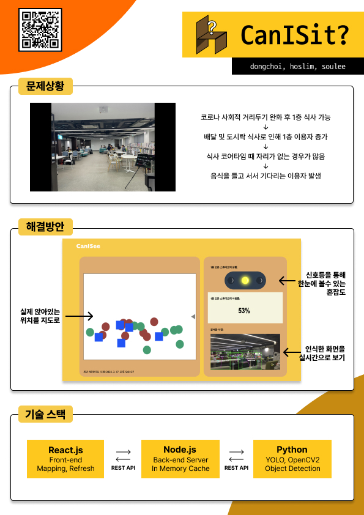
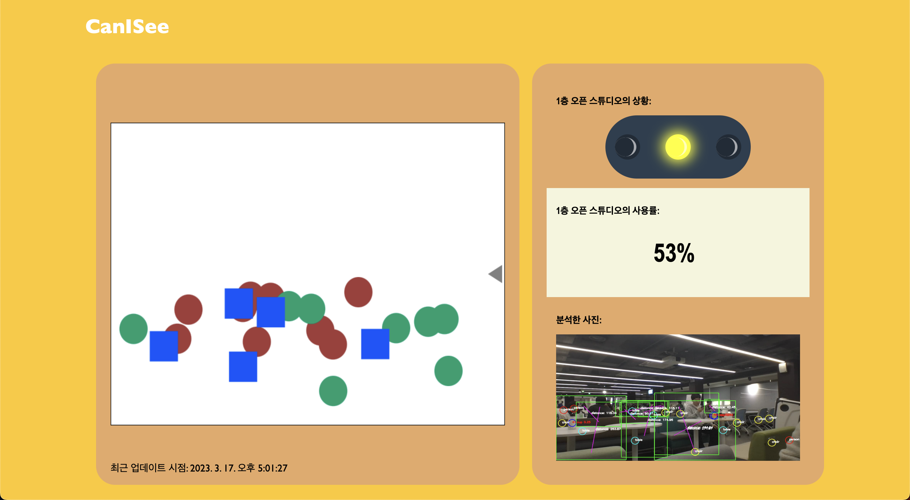

<h1 align="center">Can I Sit?</h1>

<h3 align="center">머신러닝을 활용한 착좌 감지 시스템</h3>

<p align="center">
	<a href="https://hits.seeyoufarm.com"></a>
	
</p>

> 이 프로젝트는 42 서울에서 개최한 2023년도 해커톤에서 만들었습니다. 
>(해커톤에 힘써주신 관계자 분들과 수고해주신 자원봉자사분들께 다시 한번 감사드립니다.)

## <목차>
1. 개요
* 프로젝트 명과 간단한 설명
* 프로젝트 목적
2. 설계
* 사용한 기술과 도구
* API 명세
3. 주요 기능 및 특징
4. 개발 과정
* 문제해결을 위한 생각한 방법들
* 팀원 역할과 협업 방식
5. 결과 및 시연
6. 참고 자료
<hr/>

## 1. 개요
### 프로젝트 명과 간단한 설명
  프로젝트 명은 CanISee로,점심 및 저녁을 먹거나 팀프로젝트 토론을 위해 1층을 사용하려는 분들이
일일이 자리가 있는지를 확인하는 수고를 덜어주기 위해 42서울 개포 클러스터 내에 있는 1층 오픈
스튜디오의 의자 사용량을 체크하는 간단한 스트리밍 사이트를 만들었습니다.

### 해결하고자 하는 문제상황
힘들었던 코로나 상황이 점점 좋아지고 42서울 개포 클러스터에도 사람들이 점점 많아지는 추세에 1층 오픈 스튜디오 사용률이 점점 늘어나고 있습니다.   
1층 오픈 스튜디오는 42서울분들이 편하게 이야기와 토론을 하고, 공부를 하기도 하지만, 유일하게 취식이 가능한 공간으로 여기서 배달음식을 먹거나 도시락을 가져오셔서
드시기도 합니다.    
그러면 특징이 있는 공간으로 점심시간이나 저녁식사 시간에 많은 사람들이 몰려 자리가 없어서 결국 다시 돌아가거나 기다리게 되는 경우가 있었습니다.   
그래서 이러한 노력을 줄이고 헛걸음을 방지하기 위해 1층 오픈 스튜디오의 상황을 실시간으로 분석해서 사용현황을 알릴 수 있는 서비스를 만들게 되었습니다.   
   
### 프로젝트 목적
  실시간 스트리밍보단 내려가기 위한 시간대에 사용할 수 있는 의자가 있는지 파악을 하는 게 주된 목적이며
이를 딥러닝 모델을 이용해 의자와 테이블, 사람을 감지해 수를 세주어 간단한 지표로 표시하였습니다.
그리고 실시간 1층 상황을 조금이라도 쉽게 알기 위해 탐지 결과를 띄우는 등의 기능을 넣었습니다.

## 2. 설계
### 사용한 기술과 도구
  이 프로젝트에서 사용한 기술 스택은 크게 세 가지로 나눌 수 있습니다.   
     
① 사용 가능한 좌석이 있는지 탐지하는 딥러닝 탐지 모델 Yolo v8가 있습니다.   
 - Python 3.9   
 - YOLOv8 (Machine Learning, Object Dectection)   
 - OpenCv2 (Computer Vision)   
 - FastAPI (REST API)   
 - NumPy (Mathematical)    

② 탐지한 내용을 전달하는 역할로 벡엔드 부분에선 Node.js를 사용하였습니다.   
 - node.js v19.8.1   
 - node.js express 4.18.2   
 - REST API   
   
③ 결과를 화면에 띄워주기 위해 프론트 엔드 프레임 워크로 React를 이용했습니다.
 - React   
 - Typescript   
 - REST API     

### API 명세
Media Type: application/json

```python3
response = {
	resolution: {
		width: int,
		height: int
	},
	data: [
		{
			x: float,
			y: float,
			type: str,
            		time: str
		}
	],
	image: base64.encode(img)
}	
```

## 3. 주요 기능 및 특징


## 4. 결과 및 시연


## 5. 참고자료
<https://hoslim.notion.site/2023-15ccfaa16b4f4404b033b7272b1dfdd9/>
